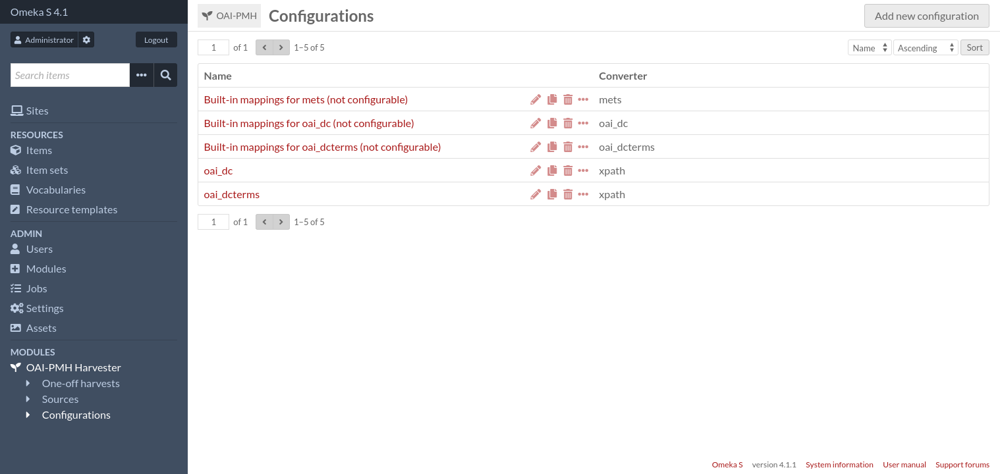
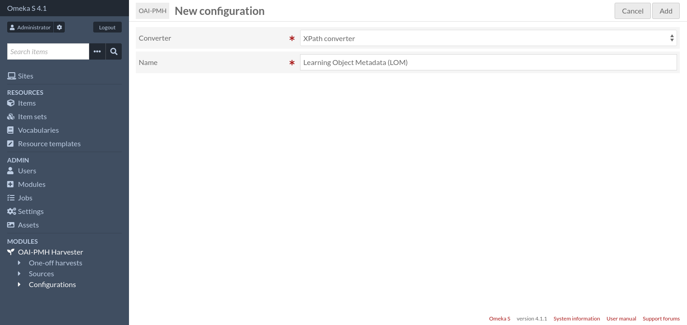
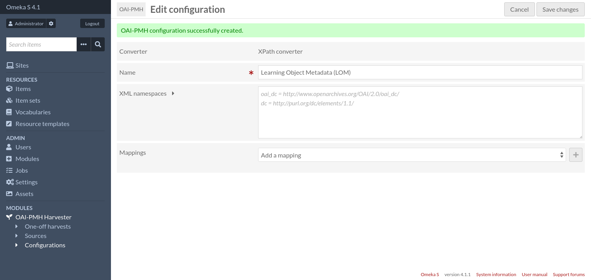
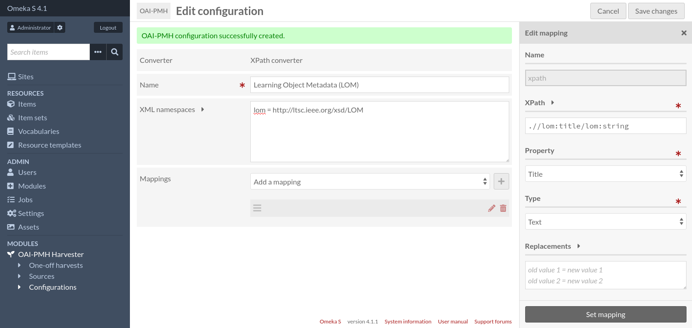
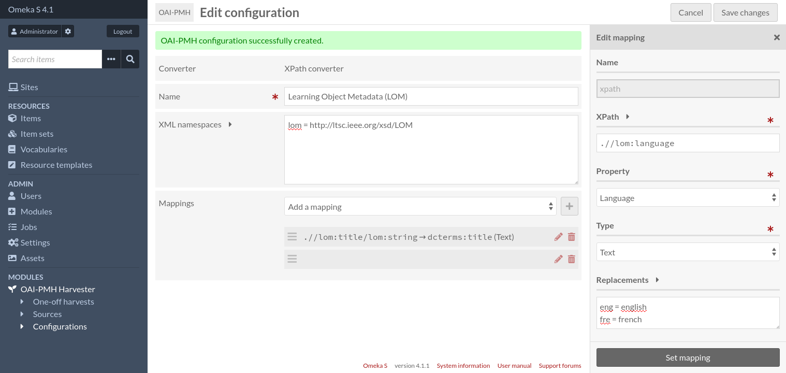
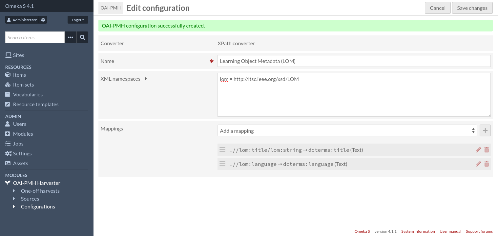
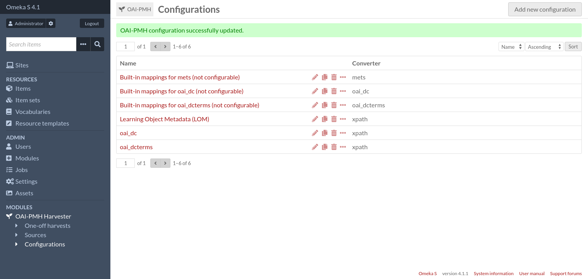
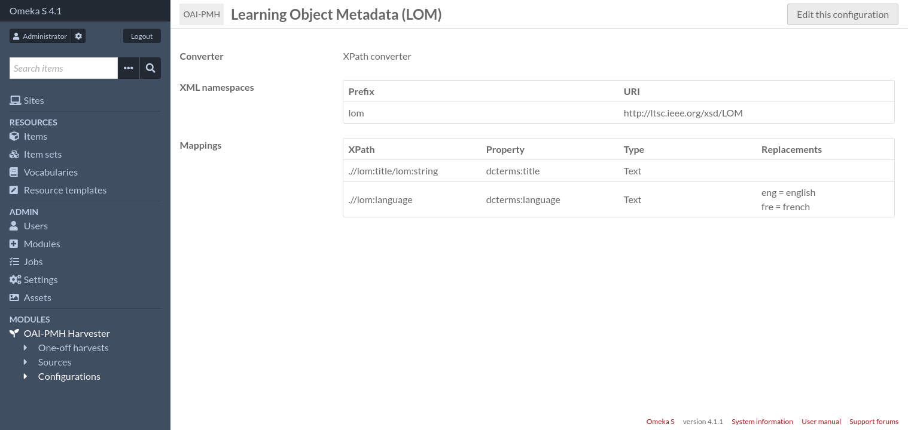

Configurations
==============

Configurations are where various settings (including mappings) can be stored and shared among multiple sources.

Configurations consist of:

* A name,
* A converter, which is the component responsible for converting an OAI-PMH record into data suitable for Omeka,
* A list of settings that depends on the selected converter (if the converter is configurable).

Configurations can be duplicated so existing configurations can be used as a starting point for new configurations.

By default there are 3 non-configurable converters that use the same mappings as one-off harvests: oai_dc, oai_dcterms
and mets.
There is also one configurable converter, "XPath converter", that allows users to specify their own mappings using XPath
expressions.

Other Omeka modules may provide additional converters.

Add a new configuration
-----------------------

To create a new configuration, go to the "Configurations" page (accessible from the administration menu).

Then click on the "Add new configuration" button.

Enter a name for the new configuration, choose the XPath converter and then click on the "Add" button.

Then you will have two important fields to set:

XML namespaces
    Namespaces used by your XPath expressions must be registered here. The only exception is the `oai` namespace which
    is always registered.

    There must be only one namespace per line, in the format: ``<prefix> = <uri>``, for instance ``oai_dc =
    http://www.openarchives.org/OAI/2.0/oai_dc/``.

Mappings
    This is where you define how OAI records will be converted to Omeka items

Add a mapping
^^^^^^^^^^^^^

To add a new mapping, select "XPath mapping" in the dropdown list and click on the "+" button. The mapping settings will
appear in a sidebar.

A mapping consist of the following fields:

XPath expression
    A relative XPath 1.0 expression that evaluates to a node or a list of nodes (XML attributes are nodes too). The
    context node for this expression will be the ``<oai:record>`` node. The value imported into Omeka will be the text
    content of this node. If several nodes matches the XPath expression, there will be one value per node.

    For instance, to get the title of an ``oai_dc`` record, you could write ``oai:metadata/oai_dc:dc/dc:title``, or
    alternatively ``.//dc:title``.

Property
    The Omeka property where the value will be stored

Type
    The type of value. Can be "Text" or "URI".

Replacements
    Optional text replacements to perform. One replacement per line. Each line must be in the format: ``old value = new
    value``. Replacement is done only if the value matches exactly.

    For instance::

        eng = english
        fre = french

Once the mapping is done, remember to click on the "Set mapping" button, otherwise the mapping's settings will be lost.

You can configure as many mappings as you need.

Once done, click on the "Save changes" button.

From the "Configurations" page, you can click on a configuration name to see the full configuration details on a single
page.

