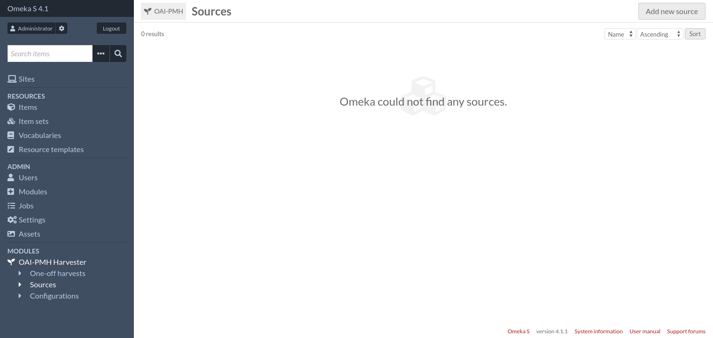
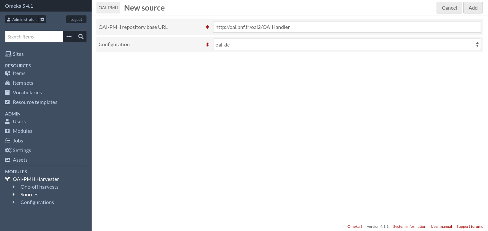
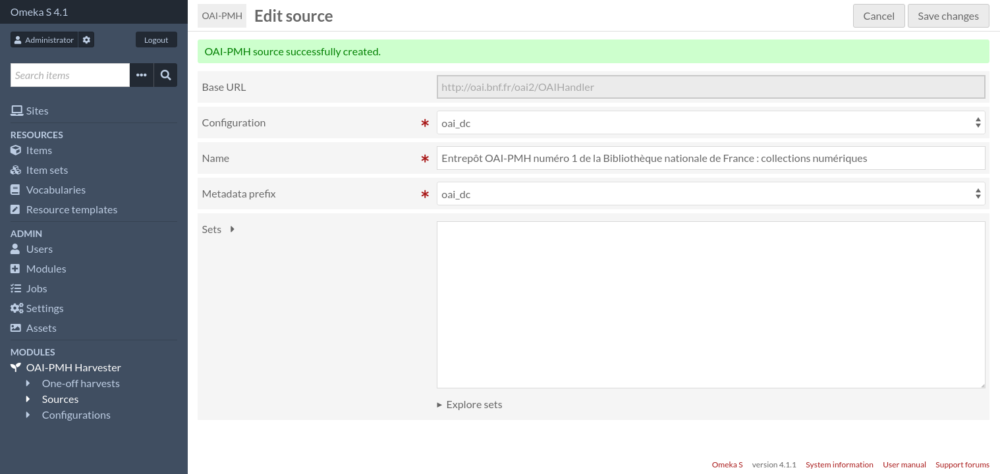
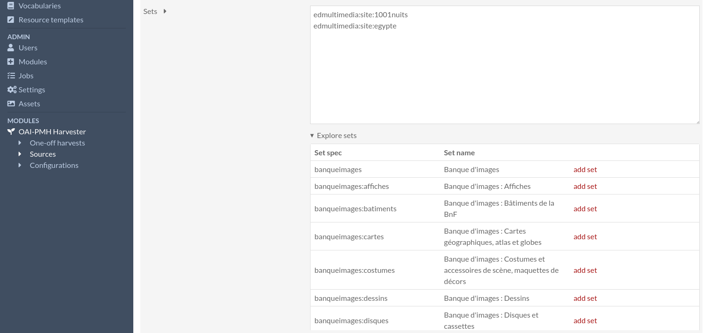
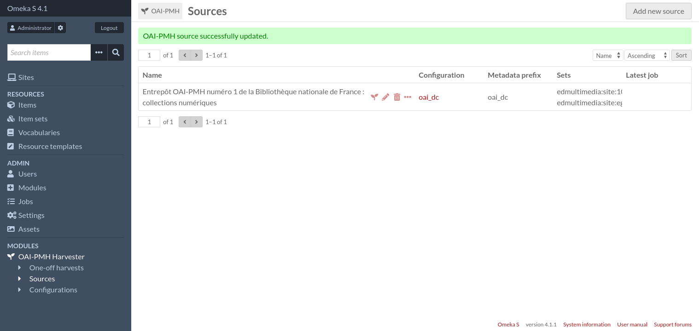
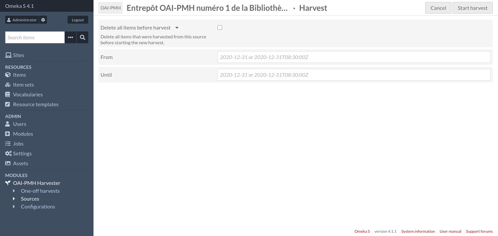
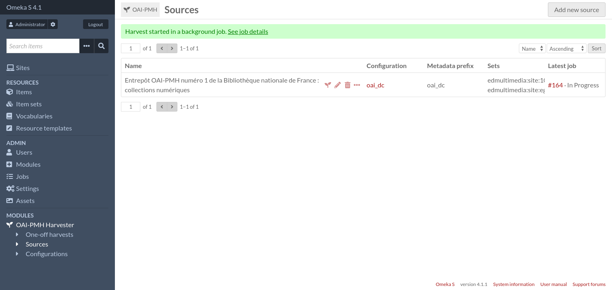
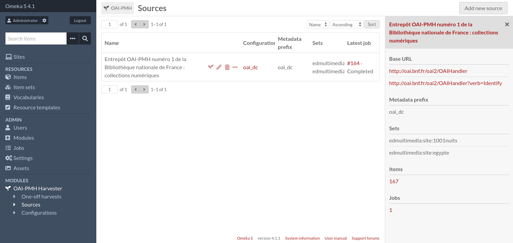
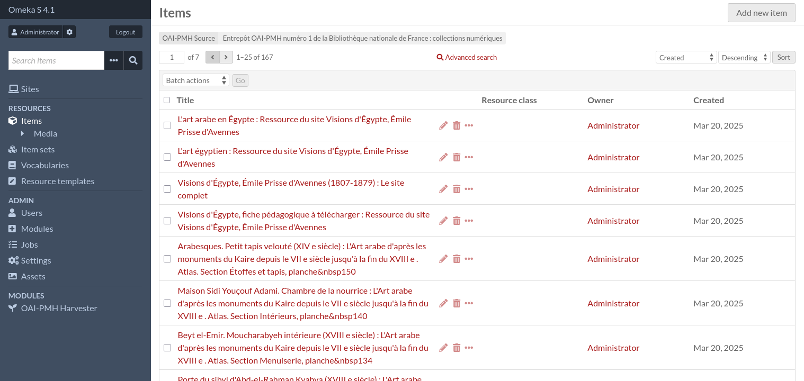
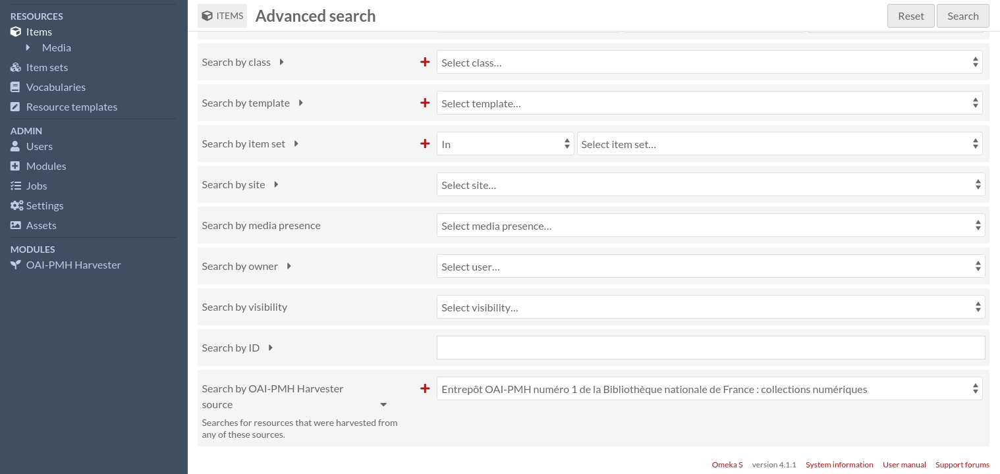

Sources
=======

Sources allow to save information about OAI-PMH repositories to make future harvests of the same repository easier.
Sources consist of:

* A name,
* An OAI-PMH repository base URL,
* A list of sets (or none, to harvest the whole repository),
* A :doc:`configuration <configurations>`.

Add a new source
----------------

To create a new source, first go to the sources page (accessible from the administration menu).

Then click on the "Add new source" button.

Enter the OAI-PMH repository base URL and select a configuration. If you are not sure about the configuration, choose
``oai_dc``. You can change the configuration later if needed.

Then click on the "Add" button.

On the "Edit source" page, you can change the source's name (which has been automatically set to the repository name)
and the metadata prefix.

You can also list all available sets and select the ones you want to harvest. You can leave the "Sets" field empty if
you want to harvest the whole repository.

Once you are done, click on the "Save changes" button.

Harvest a source
----------------

From the sources page, you can start the harvest by clicking on the seedling icon.

Fill the form if needed, then click on the "Start harvest" button.

The harvest is now being done in a background job. When the job is finished, you can get the list of harvested items by
clicking on the "three dots" icon, and then on the number under the "Items" section, in the sidebar.

You can refine your search by clicking on "Advanced search" as usual.

To configure how items are created, see the next section: :doc:`configurations`.
